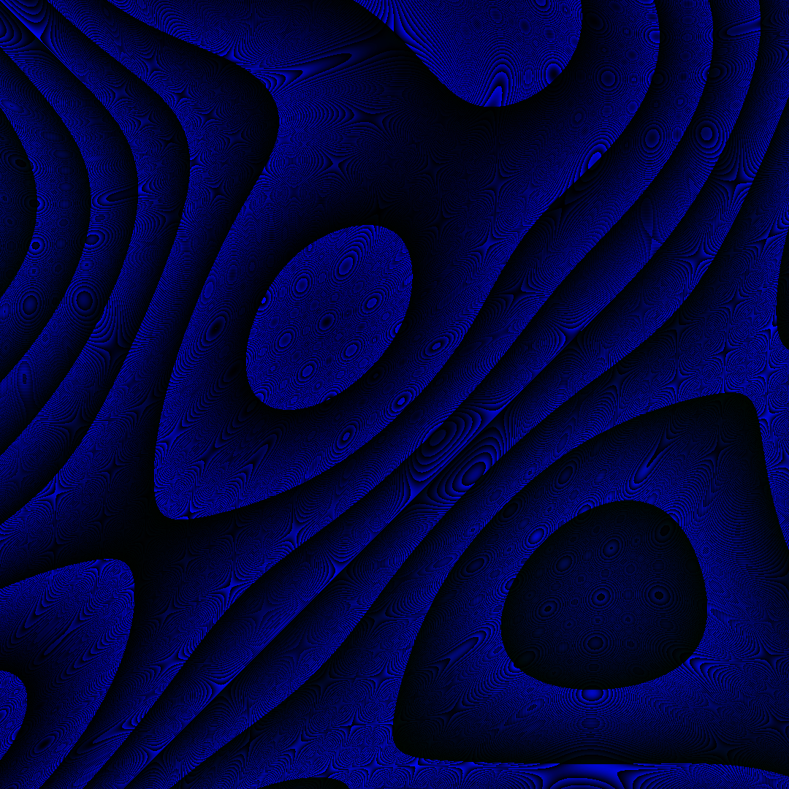
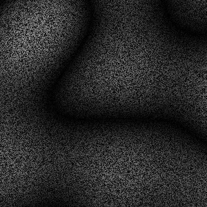
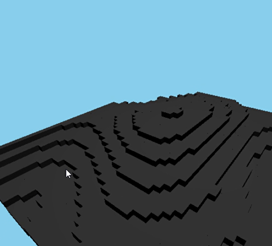

# MINEWORLD
 
Nesse projeto eu recriei a criação de mundo do Minecraft utilizando Javascript, Node.js, Three.js, Express, Jimp, Simplex-Noise e uma certa dose de criatividade.
 
---
 
### Sobre as bibliotecas e suas funções dentro da aplicação:
 
🤢**SIMPLEX-NOISE:** É ela responsável pela geração do noise, utilizando ela que é possível montar uma matriz que em seguida é enviada para as demais bibliotecas.
 
🖍️**JIMP:** Geração de imagem, é ela que recebe uma matriz e transforma em uma mapa, que é exibido na tela.
 
⏹️**THREE.JS:** É uma biblioteca 3D, ela é responsável por renderizar tudo na tela praticamente.
 
### Como você pode baixar e rodar o meu projeto:
 
O projeto já conta com todas as dependências instaladas, basta baixar e rodar o comando npm start no seu terminal, que a aplicação já estará funcionando.
 
### Tentativas de utilizar o noise:
 
Na pasta noise do projeto você pode ver várias das tentativas, erros e acertos de utilizar as bibliotecas, algumas delas inclusive tentativas de construir o algoritmo eu mesmo.
 

 

 
Imagens do processo de criação:
 

 
Aplicando o noise no 3D;
 

 
Adicionando Texturas;
 

 
Projeto Atual
 

 
Projeto Atual
 
### Considerações:
 
O projeto é desenvolvido para o uso mobile, então caso queira utilizá-lo no computador basta utilizar a device toolbar do chrome ao apertar f12.
